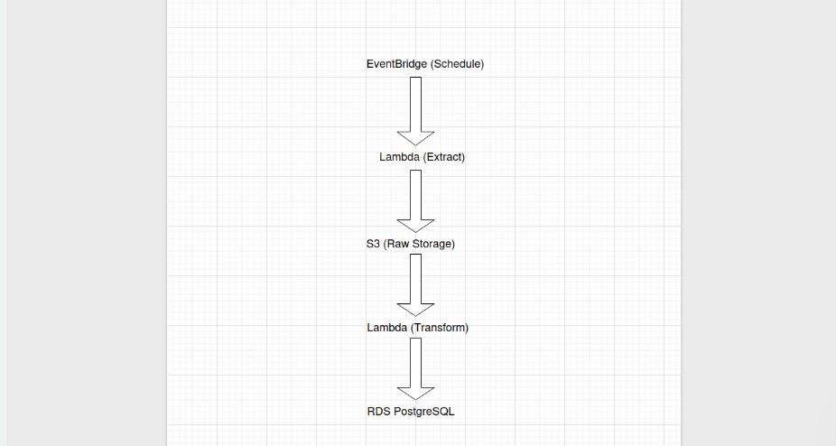

# Books ETL Pipeline (AWS)

## Architecture

## What this is
A serverless ETL pipeline that extracts book data, stores raw files in S3, transforms it, and loads results into PostgreSQL (RDS).

## AWS services used
- AWS Lambda (extract + transform)
- Amazon S3 (raw + processed storage)
- Amazon RDS PostgreSQL
- EventBridge (scheduling)
- CloudWatch (logging)
- Secrets Manager (credentials)

## How it works
1) Extract Lambda collects data and writes raw output to S3  
2) Transform Lambda cleans/transforms and loads to RDS  
3) EventBridge triggers the pipeline on a schedule

## How to deploy
See: `DEPLOYMENT_QUICK.md`

## Schedule
See: `schedule.md`
